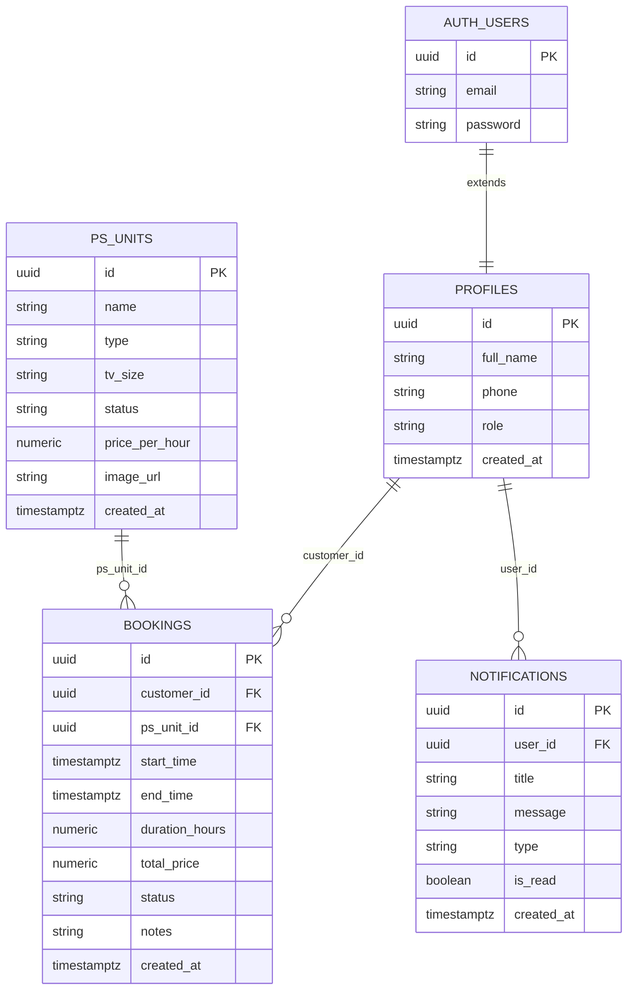
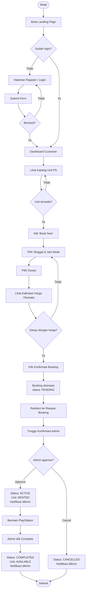
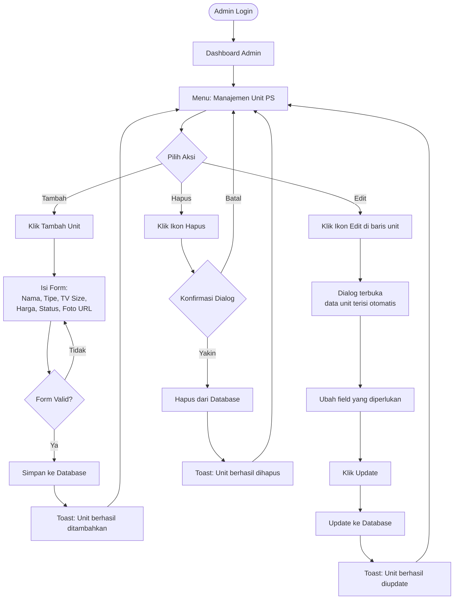
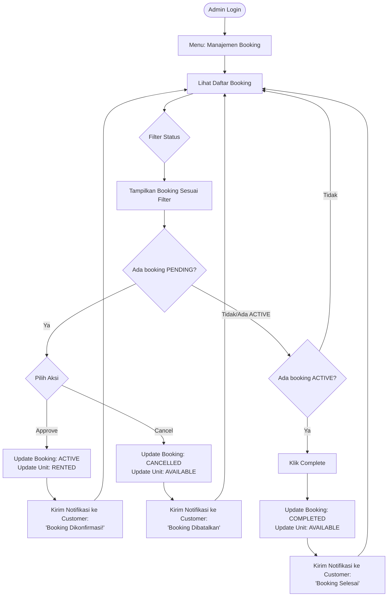
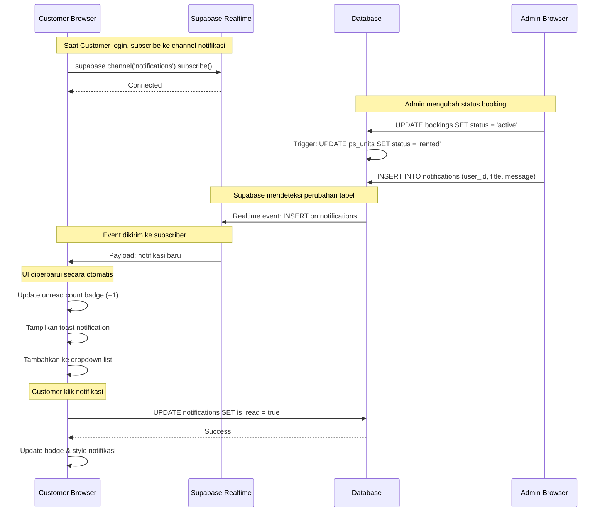
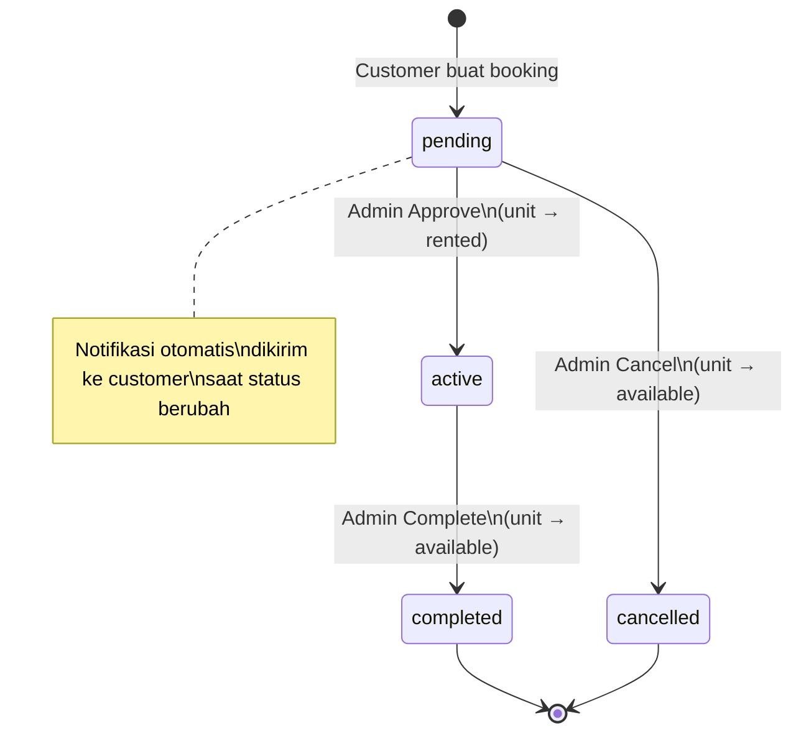

# 📋 Product Requirements Document (PRD)
## Rental PlayStation — Web Application

**Versi:** 1.0  
**Tanggal:** April 2026  
**Status:** In Development  
**Tech Stack:** Next.js 16 · Supabase · Tailwind CSS · shadcn/ui · TypeScript

---

## 1. Ringkasan Produk

Rental PS adalah aplikasi web manajemen bisnis penyewaan konsol PlayStation. Aplikasi ini menghubungkan pelanggan yang ingin menyewa unit PS dengan admin yang mengelola operasional rental. Seluruh proses — dari pencarian unit, pemesanan, konfirmasi, hingga pembayaran — dilakukan secara digital tanpa komunikasi manual.

### Permasalahan yang Diselesaikan
- Admin kesulitan melacak unit mana yang sedang disewa dan mana yang tersedia.
- Pelanggan tidak bisa melihat ketersediaan unit secara real-time sebelum datang.
- Proses booking manual (via WA/telepon) tidak efisien dan rawan double-booking.
- Tidak ada sistem pencatatan riwayat sewa dan pendapatan yang terstruktur.

---

## 2. Target Pengguna

| Segmen | Deskripsi |
|--------|-----------|
| **Pelanggan (Customer)** | Individu yang ingin menyewa konsol PS4/PS5 untuk bermain. Mendaftar sendiri via aplikasi. |
| **Admin** | Pemilik atau pengelola toko rental. Akun dibuat secara manual di database. |

---

## 3. Arsitektur Sistem

### 3.1 Tech Stack
| Komponen | Teknologi |
|----------|-----------|
| Framework | Next.js 16 (App Router) |
| Database | Supabase PostgreSQL |
| Autentikasi | Supabase Auth |
| Realtime | Supabase Realtime Channels |
| Styling | Tailwind CSS v4 + shadcn/ui |
| Font | Outfit (Google Fonts) |
| State Management | React hooks + Zustand |
| Form Handling | React Hook Form + Zod |
| Notifikasi UI | react-hot-toast + sonner |
| Deployment | — |

### 3.2 Struktur Folder
```
/app
  /(auth)/login/          ← Halaman login
  /(auth)/register/       ← Halaman registrasi
  /auth/actions.ts        ← Server actions untuk auth
  /dashboard/customer/    ← Semua halaman pelanggan
  /dashboard/admin/       ← Semua halaman admin
/components
  /ui/                    ← Komponen shadcn/ui
  /shared/                ← NotificationBell, komponen bersama
/lib
  /supabase/              ← client.ts, server.ts, middleware.ts
  /hooks/                 ← useAuth, useNotifications
  /utils/                 ← helpers (format harga, tanggal, kalkulasi)
/types/index.ts           ← Semua TypeScript type definitions
```

---

## 4. Skema Database

### 4.1 Tabel `profiles`
Memperluas tabel `auth.users` dari Supabase Auth.

| Kolom | Tipe | Keterangan |
|-------|------|------------|
| `id` | `uuid` (PK, FK) | Referensi ke `auth.users` |
| `full_name` | `text` | Nama lengkap pengguna |
| `phone` | `text` | Nomor telepon |
| `role` | `text` | `'customer'` \| `'admin'`, default: `'customer'` |
| `created_at` | `timestamptz` | Waktu registrasi |

### 4.2 Tabel `ps_units`
Inventori unit PlayStation yang dimiliki rental.

| Kolom | Tipe | Keterangan |
|-------|------|------------|
| `id` | `uuid` (PK) | ID unik unit |
| `name` | `text` | Nama unit, contoh: "PS5 - Unit 1" |
| `type` | `text` | `'PS4'` \| `'PS5'` |
| `tv_size` | `text` | Ukuran TV, contoh: "55 inch 4K HDR" |
| `status` | `text` | `'available'` \| `'rented'` \| `'maintenance'` |
| `price_per_hour` | `numeric` | Harga sewa per jam (Rupiah) |
| `image_url` | `text` | URL foto unit |
| `created_at` | `timestamptz` | Waktu data dibuat |

### 4.3 Tabel `bookings`
Rekaman semua pemesanan yang dilakukan pelanggan.

| Kolom | Tipe | Keterangan |
|-------|------|------------|
| `id` | `uuid` (PK) | ID unik booking |
| `customer_id` | `uuid` (FK) | Referensi ke `profiles.id` |
| `ps_unit_id` | `uuid` (FK) | Referensi ke `ps_units.id` |
| `start_time` | `timestamptz` | Waktu mulai sewa |
| `end_time` | `timestamptz` | Waktu berakhir sewa |
| `duration_hours` | `numeric` | Total durasi dalam jam |
| `total_price` | `numeric` | Total biaya sewa |
| `status` | `text` | `'pending'` \| `'active'` \| `'completed'` \| `'cancelled'` |
| `notes` | `text` | Catatan opsional dari pelanggan |
| `created_at` | `timestamptz` | Waktu booking dibuat |

### 4.4 Tabel `notifications`
Sistem notifikasi dalam aplikasi untuk pelanggan.

| Kolom | Tipe | Keterangan |
|-------|------|------------|
| `id` | `uuid` (PK) | ID unik notifikasi |
| `user_id` | `uuid` (FK) | Referensi ke `profiles.id` |
| `title` | `text` | Judul notifikasi |
| `message` | `text` | Isi pesan notifikasi |
| `type` | `text` | `'booking_confirmed'` \| `'booking_reminder'` \| `'booking_completed'` |
| `is_read` | `boolean` | Status baca, default: `false` |
| `created_at` | `timestamptz` | Waktu notifikasi dibuat |

---

## 5. Keamanan — Row Level Security (RLS)

| Tabel | Policy | Aturan |
|-------|--------|--------|
| `profiles` | Select | User hanya bisa membaca profilnya sendiri |
| `profiles` | Update | User hanya bisa mengubah profilnya sendiri |
| `ps_units` | Select | Semua orang bisa melihat daftar unit |
| `ps_units` | All | Hanya admin (`role = 'admin'`) yang bisa CRUD |
| `bookings` | Select | Customer hanya bisa melihat bookingnya sendiri |
| `bookings` | Insert | Customer hanya bisa membuat booking atas namanya sendiri |
| `bookings` | All | Admin bisa mengelola semua booking |
| `notifications` | Select | User hanya bisa melihat notifikasinya sendiri |
| `notifications` | Update | User hanya bisa menandai notifikasinya sendiri |
| `notifications` | All | Admin bisa mengelola semua notifikasi |

### Trigger Otomatis
Setiap kali user baru terdaftar di `auth.users`, trigger `on_auth_user_created` akan otomatis membuat baris di tabel `profiles` dengan `role = 'customer'`.

---

## 6. Alur Pengguna (User Flows)

### 6.1 Alur Pelanggan

```
Landing Page (/)
    ↓
Registrasi (/register)  ←→  Login (/login)
    ↓
Dashboard Pelanggan (/dashboard/customer)
    ├── Lihat katalog unit PS (dengan foto, harga, status)
    ├── Klik "Book Now" → Form Booking (/dashboard/customer/booking)
    │       ├── Pilih unit (otomatis terisi jika dari katalog)
    │       ├── Pilih tanggal & jam mulai
    │       ├── Pilih durasi (1–8 jam)
    │       ├── Lihat ringkasan harga otomatis
    │       └── Konfirmasi → Booking tersimpan (status: pending)
    ├── Riwayat Booking (/dashboard/customer/history)
    │       └── Filter by status (Semua / Pending / Aktif / Selesai / Dibatalkan)
    ├── Profil (/dashboard/customer/profile)
    │       └── Edit nama lengkap & nomor telepon
    └── Notifikasi (Bell Icon)
            ├── Dropdown list notifikasi dengan badge unread count
            ├── Klik notifikasi → tandai sebagai dibaca
            └── Tombol "Tandai semua dibaca"
```

### 6.2 Alur Admin

```
Login (/login)
    ↓
Admin Dashboard (/dashboard/admin)
    ├── Overview — Statistik real-time:
    │       ├── Total unit
    │       ├── Unit sedang disewa
    │       ├── Booking pending
    │       └── Total revenue (dari booking completed)
    ├── Manajemen Unit (/dashboard/admin/units)
    │       ├── Lihat semua unit dalam format tabel
    │       ├── Tambah unit baru (nama, tipe, TV size, harga, status, foto)
    │       ├── Edit unit yang ada
    │       └── Hapus unit (dengan konfirmasi)
    ├── Manajemen Booking (/dashboard/admin/bookings)
    │       ├── Lihat semua booking dengan filter status
    │       ├── Approve booking pending → status: active (unit → rented)
    │       ├── Cancel booking pending → status: cancelled (unit → available)
    │       ├── Complete booking aktif → status: completed (unit → available)
    │       └── Notifikasi otomatis dikirim ke customer saat status berubah
    └── Kirim Notifikasi (/dashboard/admin/notifications)
            ├── Kirim ke semua pelanggan
            └── Kirim ke pelanggan tertentu (pilih dari dropdown)
```

---

## 7. Fitur & Spesifikasi Fungsional

### F-01: Autentikasi
- **Registrasi**: Email, password, nama lengkap, nomor telepon.
- **Login**: Email + password. Setelah login, sistem membaca `role` dari tabel `profiles`.
- **Redirect**: Customer → `/dashboard/customer`, Admin → `/dashboard/admin` (dicek di layout admin).
- **Proteksi Route**: Middleware Next.js memastikan sesi valid di semua halaman protected.
- **Logout**: Menghapus sesi Supabase Auth.

### F-02: Katalog Unit PS
- Menampilkan semua unit dari tabel `ps_units`, diurutkan berdasarkan `created_at`.
- Setiap kartu unit menampilkan: foto, nama, tipe (PS4/PS5), ukuran TV, status, dan harga per jam.
- Badge status berwarna: Hijau (available), Biru (rented), Abu-abu (maintenance).
- Tombol "Book Now" hanya aktif jika status unit adalah `available`.

### F-03: Form Booking
- **Validasi**: Semua field wajib diisi sebelum submit.
- **Kalkulasi Harga Otomatis**: `total_price = price_per_hour × duration_hours`, tampil real-time.
- **Durasi**: Pilihan 1–8 jam via dropdown.
- **Status Awal**: Setiap booking baru tersimpan dengan status `pending`.
- **Pre-select Unit**: Jika datang dari halaman katalog dengan `?unit=id`, unit otomatis terpilih.

### F-04: Manajemen Status Booking (Admin)
| Aksi Admin | Status Sebelum | Status Sesudah | Status Unit | Notifikasi Customer |
|------------|---------------|----------------|-------------|---------------------|
| Approve | `pending` | `active` | `rented` | "Booking Dikonfirmasi!" |
| Cancel | `pending` | `cancelled` | `available` | "Booking Dibatalkan" |
| Complete | `active` | `completed` | `available` | "Booking Selesai" |

### F-05: Sistem Notifikasi
- **Realtime**: Menggunakan `supabase.channel()` untuk subscribe perubahan tabel `notifications`.
- **Badge**: Ikon lonceng menampilkan jumlah notifikasi yang belum dibaca (max tampil "9+").
- **Mark as Read**: Klik satu notifikasi → tandai dibaca. Ada tombol "Tandai semua dibaca".
- **Admin Broadcast**: Admin bisa mengirim notifikasi custom ke satu atau semua pelanggan.

### F-06: Manajemen Unit PS (Admin)
- CRUD lengkap via dialog modal (tanpa pindah halaman).
- Field: nama, tipe (PS4/PS5), ukuran TV, harga per jam, status, URL foto.
- Konfirmasi dialog sebelum menghapus unit.
- Toast notification untuk setiap aksi berhasil/gagal.

### F-07: Profil Pengguna
- Customer dapat mengubah nama lengkap dan nomor telepon.
- Email tidak dapat diubah (read-only, dikunci dari Supabase Auth).

---

## 8. Spesifikasi Non-Fungsional

### 8.1 Performa
- Halaman server-side (Server Components) untuk data awal yang tidak membutuhkan interaksi.
- Halaman client-side (Client Components) untuk data yang memerlukan filter real-time atau interaksi pengguna.

### 8.2 Responsivitas
- **Desktop**: Sidebar navigasi di sisi kiri.
- **Mobile**: Bottom navigation bar yang fixed di bagian bawah layar.
- Semua tabel dan grid menyesuaikan ukuran layar.

### 8.3 Keamanan
- Seluruh akses database melalui RLS Supabase.
- Server Actions untuk operasi auth (tidak terekspos di client-side).
- Admin route dilindungi di level layout: jika `role !== 'admin'`, redirect ke dashboard customer.

### 8.4 UX & Desain
- Tema: PlayStation 5 aesthetic — putih bersih, aksen biru navy (`#00439c`), font Outfit.
- Efek glassmorphism pada kartu statistik dashboard.
- Animasi floating pada elemen dekoratif di landing page.
- Ikon geometris PlayStation (segitiga, lingkaran, silang, kotak) sebagai elemen visual.

---

## 9. Logika Bisnis

1. **Kalkulasi Harga**: `total_price = duration_hours × price_per_hour`
2. **Status Unit Otomatis**: Dikelola sisi admin saat mengubah status booking (bukan otomatis berbasis waktu).
3. **Satu Unit, Satu Booking Aktif**: Unit yang sedang `rented` tidak bisa di-booking ulang (tombol "Book Now" tidak tampil).
4. **Akun Admin**: Dibuat secara manual di Supabase dengan mengubah kolom `role` menjadi `'admin'` di tabel `profiles`.

---

## 10. Halaman & Komponen

| URL | Tipe | Komponen Utama |
|-----|------|----------------|
| `/` | Server | Hero, Features Grid, Navigation, Footer |
| `/login` | Client | Form Login, Server Action |
| `/register` | Client | Form Register, Server Action |
| `/dashboard/customer` | Server | Katalog Unit, Stat Cards |
| `/dashboard/customer/booking` | Client | Form Booking, Price Calculator |
| `/dashboard/customer/history` | Client | Daftar Booking, Filter Status |
| `/dashboard/customer/profile` | Client | Form Edit Profil |
| `/dashboard/admin` | Server | Stat Cards, Recent Bookings, Quick Actions |
| `/dashboard/admin/units` | Client | Tabel Unit, Dialog CRUD |
| `/dashboard/admin/bookings` | Client | Tabel Booking, Action Buttons |
| `/dashboard/admin/notifications` | Client | Form Kirim Notifikasi |

### Komponen Bersama
- **`NotificationBell`**: Ikon lonceng dengan dropdown, badge unread, mark as read. Dipakai di layout customer dan admin.
- **Customer Layout**: Sidebar (desktop) + Bottom Nav (mobile) + NotificationBell.
- **Admin Layout**: Sidebar (desktop) + Bottom Nav (mobile) + NotificationBell + Guard role admin.

---

## 11. Diagram

### 11.1 Entity Relationship Diagram (ERD)



---

### 11.2 Activity Diagram — Alur Booking Pelanggan



---

### 11.3 Activity Diagram — Manajemen Unit PS oleh Admin



---

### 11.4 Activity Diagram — Manajemen Booking oleh Admin



---

### 11.5 Sequence Diagram — Sistem Notifikasi Real-time



---

### 11.6 Diagram Status Booking



---

## 12. Batasan & Asumsi Saat Ini (v1.0)

| Item | Status | Keterangan |
|------|--------|------------|
| Upload foto unit | ❌ Belum | Saat ini hanya menerima URL foto eksternal |
| Reminder otomatis | ❌ Belum | Notifikasi masih manual atau dipicu saat admin ubah status |
| Pembayaran online | ❌ Belum | Sistem hanya mencatat booking, tidak ada payment gateway |
| Konflik jadwal booking | ⚠️ Parsial | Tidak ada validasi tumpang tindih waktu booking untuk unit yang sama |
| Dark mode | ❌ Dihapus | Tema dark mode dihapus di versi saat ini untuk menjaga konsistensi desain |
| Zod validation | ⚠️ Parsial | Validasi dasar ada di form, Zod schema belum diimplementasi penuh |

---

## 12. Rencana Pengembangan (Roadmap)

### v1.1 — Prioritas Tinggi
- [ ] Validasi konflik jadwal booking (cek tumpang tindih `start_time` & `end_time` per unit)
- [ ] Upload foto unit via Supabase Storage
- [ ] Zod schema validation di semua form

### v1.2 — Prioritas Sedang
- [ ] Reminder otomatis berbasis pg_cron (30 menit sebelum sewa berakhir)
- [ ] Halaman detail unit PS (foto, deskripsi lengkap, riwayat ketersediaan)
- [ ] Laporan pendapatan dengan filter periode (harian/mingguan/bulanan)

### v2.0 — Jangka Panjang
- [ ] Integrasi payment gateway (Midtrans/Xendit)
- [ ] QR Code untuk check-in booking di lokasi
- [ ] Multi-cabang / multi-tenant
- [ ] Aplikasi mobile (React Native / PWA)
